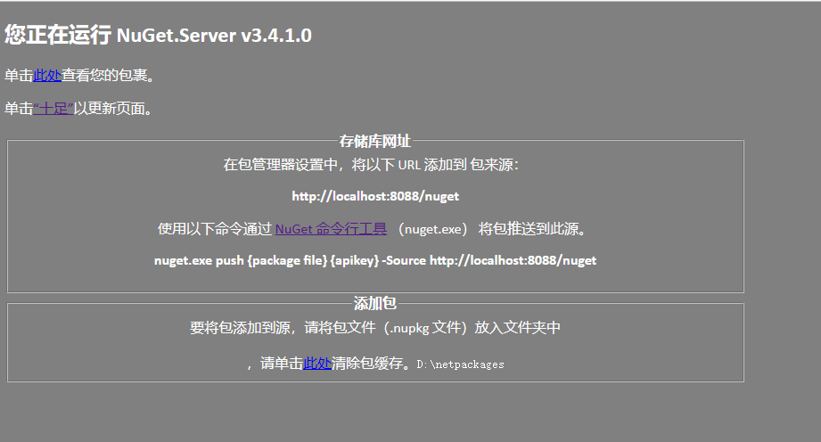

# NetPackagesServer

## 发布

## 启动

> 默认端口：44376

http://localhost:8088/ 




## 修改配置

> *只需修改requireApiKey，apiKey、packagesPath、cacheFileName等value值即可*

```base
<appSettings>
    <!--
    Determines if an Api Key is required to push\delete packages from the server. 
    -->
    <add key="requireApiKey" value="true" />
    <!-- 
    Set the value here to allow people to push/delete packages from the server.
    NOTE: This is a shared key (password) for all users.
    -->
    <add key="apiKey" value="key值填着里" />
    <!--
    Change the path to the packages folder. Default is ~/Packages.
    This can be a virtual or physical path.
    -->
    <add key="packagesPath" value="本地路径位置" />
    <!--
    Change the name of the internal cache file. Default is machine name (System.Environment.MachineName).
    This is the name of the cache file in the packages folder. No paths allowed.
    -->
    <add key="cacheFileName" value="" />
    <!--
    Set allowOverrideExistingPackageOnPush to false to mimic NuGet.org's behaviour (do not allow overwriting packages with same id + version).
    -->
    <add key="allowOverrideExistingPackageOnPush" value="false" />
    <!--
    Set ignoreSymbolsPackages to true to filter out symbols packages. Since NuGet.Server does not come with a symbol server,
    it makes sense to ignore this type of packages. When enabled, files named `.symbols.nupkg` or packages containing a `/src` folder will be ignored.
    
    If you only push .symbols.nupkg packages, set this to false so that packages can be uploaded.
    -->
    <add key="ignoreSymbolsPackages" value="true" />
    <!--
    Set enableDelisting to true to enable delist instead of delete as a result of a "nuget delete" command.
    - delete: package is deleted from the repository's local filesystem.
    - delist: 
      - "nuget delete": the "hidden" file attribute of the corresponding nupkg on the repository local filesystem is turned on instead of deleting the file.
      - "nuget list" skips delisted packages, i.e. those that have the hidden attribute set on their nupkg.
      - "nuget install packageid -version version" command will succeed for both listed and delisted packages.
        e.g. delisted packages can still be downloaded by clients that explicitly specify their version.
    -->
    <add key="enableDelisting" value="false" />
    <!--
    Set enableFrameworkFiltering to true to enable filtering packages by their supported frameworks during search.
    -->
    <add key="enableFrameworkFiltering" value="false" />
    <!--
    When running NuGet.Server in a NAT network, ASP.NET may embed the server's internal IP address in the V2 feed.
    Uncomment the following configuration entry to enable NAT support.
    -->
    <!-- <add key="aspnet:UseHostHeaderForRequestUrl" value="true" /> -->
    <!--
    Set enableFileSystemMonitoring to true (default) to enable file system monitoring (which will update the package cache appropriately on file system changes).
    Set it to false to disable file system monitoring.
    NOTE: Disabling file system monitoring may result in increased storage capacity requirements as package cache may only be purged by a background job running 
    on a fixed 1-hour interval.
    -->
    <add key="enableFileSystemMonitoring" value="true" />
    <!--
    Set allowRemoteCacheManagement to true to enable the "clear cache" and other cache operations initiated via requests originating from remote hosts.
    -->
    <add key="allowRemoteCacheManagement" value="false" />
    <!--
    Set initialCacheRebuildAfterSeconds to the number of seconds to wait before starting the cache rebuild timer.
    Defaults to 15 seconds if excluded or an invalid value.
    -->
    <add key="initialCacheRebuildAfterSeconds" value="15" />
    <!--
    Set cacheRebuildFrequencyInMinutes to the frequency in minutes to rebuild the cache. Defaults to 60 minutes if
    excluded or an invalid value.
    -->
    <add key="cacheRebuildFrequencyInMinutes" value="60" />
  </appSettings>
 
```

